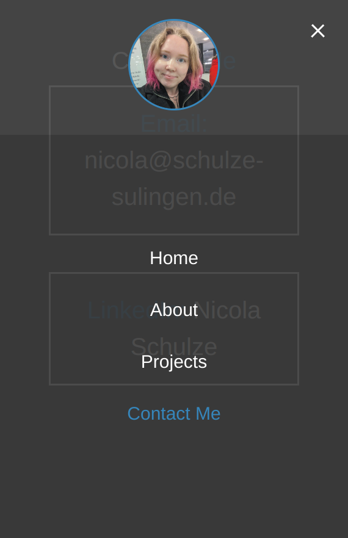
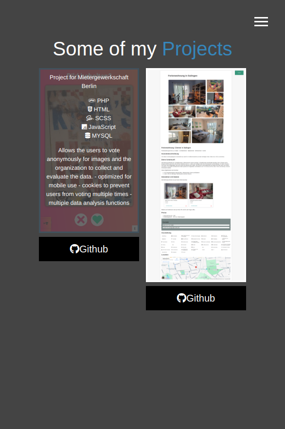

# Portfolio

A simple portfolio website designed to improve CSS and design skills.

## Demo

<p align="center">
  
  
  
</p>

## Features

- Responsive design
- CSS animations
- Clean and modern UI

## Installation

1. Clone the repository:

   ```bash
   git clone https://github.com/nicolaaaa/portfolio.git
   ```
2. Open the `index.html` file in your browser.

## Technologies Used
- HTML
- CSS
- JavaScript 
